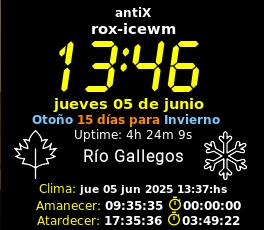
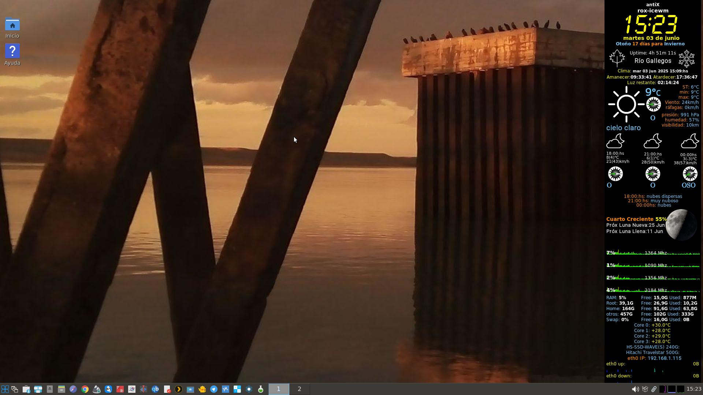

# OpenWeatherMap-wather-conky-master

conky with openWeatherMap API plus a compass to indicate wind direction and moon phases using perl

More info: https://drcalambre.blogspot.com/2023/09/conky-implementando-perl-para-las-fases.html

Although my blog is in Spanish, there is a language translator for a better understanding. 

Best regards 

;)

* * *
# **Update in 06/03/25**
**This update introduces a new Conky configuration that displays the remaining daylight hours until sunset, calculated using a new script `horas_luz.sh`.**

This update enhances Conky to show the remaining daylight time until sunset, dynamically calculated based on the sunset time provided by the OpenWeatherMap API. This feature is particularly useful for planning outdoor activities, such as a bicycle ride to arrive home by sunset in Río Gallegos, Argentina.

## Description of the Update

The new feature adds a "Remaining Daylight" field in Conky, displayed on a separate line, showing the time left until sunset in `hh:mm:ss` format. It utilizes a Bash script (`horas_luz.sh`) that calculates the difference between the current system time and the sunset time retrieved from `~/.cache/openweathermap.json`.

### Script: `horas_luz.sh`
Located in `~/.config/conky/scripts/horas_luz.sh`, this script:
- Accepts a sunset time as an argument in `hh:mm:ss` format.
- Validates the input format and compares it with the current system time.
- Calculates the remaining hours, minutes, and seconds until sunset.
- Outputs the result in `hh:mm:ss` format (e.g., `03:56:10`).
- Returns `0` if the sunset has already occurred.

**Example usage in terminal**:
```bash
./horas_luz.sh "$(cat ~/.cache/openweathermap.json | jq -r .sys.sunset | awk '{print strftime("%H:%M:%S",$1)}')"
```
## The new feature "Remaining Daylight":


* * *
# **Update in 03/08/24**
**This update introduces a new `conky.conf` configuration that monitors the temperature of two hard drives and displays an alert if the temperature is critical.**

```markdown
## Updated `conky.conf` File


```plaintext
conky.config = {
    alignment = 'top_right',
    background = false,
    double_buffer = true,
    update_interval = 1.0,
    total_run_times = 0,
    own_window = true,
    own_window_type = 'override',
    own_window_transparent = true,
    own_window_hints = 'undecorated,below,sticky,skip_taskbar,skip_pager',
    draw_borders = false,
    draw_graph_borders = true,
    default_color = 'white',
    default_shade_color = 'black',
    default_outline_color = 'black',
    use_xft = true,
    font = 'DejaVu Sans Mono:size=10',
    xftalpha = 0.8,
    override_utf8_locale = true,
    draw_outline = false,
    draw_shades = false,
    no_buffers = true,
    uppercase = false,
    cpu_avg_samples = 2,
    net_avg_samples = 2,
    text_buffer_size = 2048,
};

conky.text = [[
${color grey}Temperature of /dev/sda: ${execi 8 sudo smartctl -A /dev/sda | grep -i 'temperature_celsius' | awk '{if ($10 >= 50) print "ALERT! CRITICAL: " $10 "°C"; else print $10 "°C";}'}
${color grey}Temperature of /dev/sdb: ${execi 8 sudo smartctl -A /dev/sdb | grep -i 'temperature_celsius' | awk '{if ($10 >= 50) print "ALERT! CRITICAL: " $10 "°C"; else print $10 "°C";}'}
]];
```

### Explanation

1. **`execi` Command**: Executes an external command at specified intervals (in this case, every 8 seconds).
2. **`sudo smartctl -A /dev/sda`**: Retrieves the SMART information of the disk.
3. **`grep -i 'temperature_celsius'`**: Filters the line containing the temperature.
4. **`awk`**: Compares the temperature to a critical value (50°C). If the temperature is equal to or greater than 50°C, it displays an alert; otherwise, it shows the normal temperature.

### `sudo` Permissions

To allow Conky to execute `smartctl` with `sudo` without requiring a password, add a rule to `sudoers`. Edit the `sudoers` file with `visudo`:

```plaintext
sudo visudo
```

Add the following line at the end of the file, replacing `your_username` with the appropriate username:

```plaintext
your_username ALL=(ALL) NOPASSWD: /usr/sbin/smartctl
```

This will enable `smartctl` to run with `sudo` without requiring a password when invoked by Conky.

With these changes, Conky will directly display the temperature of the disks and highlight if any of them reach a critical level.

## Screenshots


The desktop wallpaper is a photograph of a sunset on one of my bicycle rides along the Rio Gallegos coastal (Argentina).



## The new icons for the stations:


## Argentine Postcards and the seasons:

In San Martin de los Andes, a city in the southwest of the province of Neuquén, nestled in the Andes Mountains.
The transition from autumn to winter.
A beautiful mix of colors with the early arrival of the snow.


* * *
# **Update in 02/06/24**
**calculate if it is spring, summer, autumn or winter.**

This update for Conky is useful for those who want to have updated information about the seasons of 
the year and the days remaining until the change of season, based on their geographical location. 

With this implementation, Conky can dynamically display the current season of the year and the remaining
days until the next season right on your desktop.

## Description of the Script
In `~/.config/conky/scripts/GetStation.sh`


This script calculates the current season (whether spring, summer, fall or winter) and the days remaining 
for the next season based on the current location.

Get Latitude: The script utilizes the ipinfo.io service to obtain the latitude of the user's current location.

Determine Hemisphere: 
Based on the obtained latitude, the script determines whether the user is in the northern or southern hemisphere.

Get Current Date: The script obtains the current date in the YYYY-MM-DD format.

Set Season Start Dates:

For the Northern Hemisphere:

Spring: March 21
Summer: June 21
Autumn: September 21
Winter: December 21

For the Southern Hemisphere:

Spring: September 21
Summer: December 21
Autumn: March 21
Winter: June 20

Calculate Current and Next Season: 
The script compares the current date with the season start dates to determine the current season and the next season.

Calculate Remaining Days for Next Season: 
The script calculates the number of days remaining until the start of the next season.
Determine Text for Remaining Days: Depending on the number of remaining days, the script generates 
appropriate text (e.g., "one day until" or "X days until").

Copy Season Icons: 
The script copies the corresponding icons for the current season and the next season to the user's temporary directory.

Show Results: Finally, the script displays the current season, the icon of the current season, the next season, the icon 
of the next season, and the text for the remaining days.
