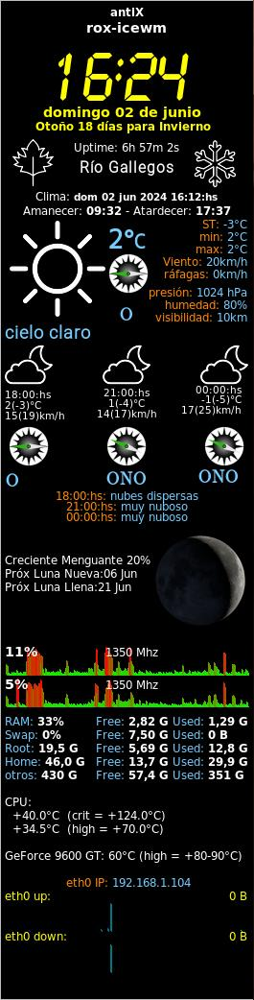

# OpenWeatherMap-wather-conky-master

conky with openWeatherMap API plus a compass to indicate wind direction and moon phases using perl

More info: https://drcalambre.blogspot.com/2023/09/conky-implementando-perl-para-las-fases.html

Although my blog is in Spanish, there is a language translator for a better understanding. 

Best regards 

;)

* * *
# **Update in 02/06/24**
**calculate if it is spring, summer, autumn or winter.**

GetStation.sh
This script calculates the current season (whether spring, summer, fall or winter) and the days remaining for the next season based on the current location.

Description
The script performs the following tasks:

Gets the latitude of the current location using the ipinfo.io service.
Determines the hemisphere (northern or southern) based on latitude.
Set the start dates of the seasons according to the hemisphere.
Calculates the current season and the next season based on the current date.
Calculate the remaining days until the next season.
Copies the icons for the current station and the next station to a user's temporary directory.
Displays the current station, the corresponding icon, the next station, the corresponding icon, and the days remaining for the next station in the format current_station;current_icon;next_station;next_icon;days_remaining.

## Screenshots

