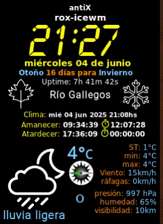
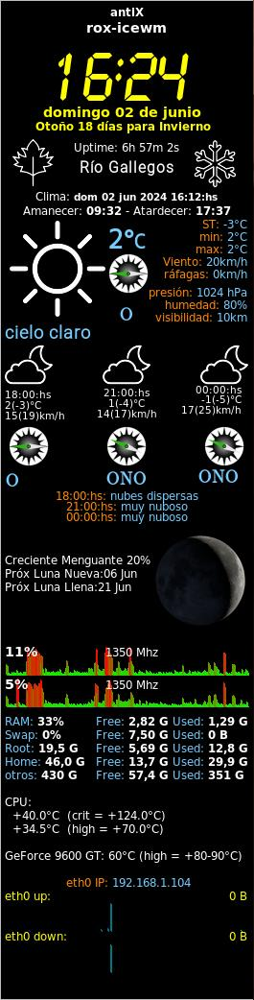
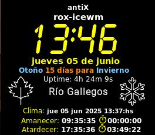
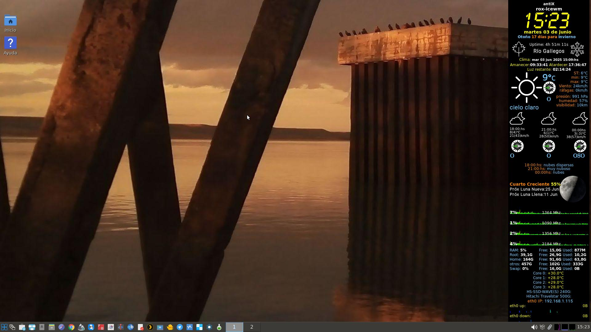

# OpenWeatherMap-wather-conky-master

A Conky configuration using the **OpenWeatherMap API**, featuring:
- Weather information
- Wind direction compass
- Moon phases
- Seasonal indicators
- Remaining daylight until sunrise/sunset

Implemented using **Bash, Perl and Conky**, designed and tested primarily on **AntiX Linux + IceWM**.

📖 More info (Spanish):  
https://drcalambre.blogspot.com/2023/09/conky-implementando-perl-para-las-fases.html  
(A language translator is available on the blog.)

---
If this project makes your desktop more enjoyable or helps you plan your day under the Sun and the Moon, consider buying me a coffee. Your gesture keeps me motivated to continue improving it.

☕ Invite me a coffee :)

[](https://cafecito.app/drcalambre)

---

# ✨ Design Philosophy

This project is intended to be more than a collection of Conky widgets.

The objective is to create a compact environmental dashboard where information is organized through typography, colour, iconography and Cairo graphics. Rather than filling the desktop with numbers, each visual element is designed to communicate its importance at a glance while maintaining a clean and unobtrusive appearance.

Every design decision aims to balance readability, aesthetics and performance, allowing the interface to remain lightweight enough for low-resource systems while providing a polished desktop experience.

## Typography and Visual Hierarchy

Typography is one of the main tools used to organize information throughout the dashboard. Instead of relying on a single font, different typefaces are combined according to their visual characteristics and intended purpose.

| Font | Purpose |
|------|---------|
| **LCD2** | Large digital clock and forecast times. Simulates segmented LCD displays for immediate readability. |
| **LCDMono** | Sunrise, sunset and astronomical times. A monospaced digital style reinforces the concept of precision. |
| **DejaVu Sans** | Primary interface font used for labels, titles and system information because of its excellent readability and wide Unicode coverage. |
| **Roboto Light** | Weather descriptions and location names. Its lighter appearance visually separates descriptive information from numerical data. |
| **VL PGothic** | Current temperature. Rounded glyphs provide a softer appearance while emphasizing the most important weather value. |
| **Material Design Icons** | Interface symbols such as sunrise, sunset and stopwatch indicators. |
| **Symbola** | Unicode symbols including wind direction arrows and solar icons. |
| **Noto Color Emoji** | Moon phase emojis rendered by the Cairo lunar bar (recommended). |

Different font sizes and weights establish a clear visual hierarchy:

- Large fonts immediately attract attention (clock and current temperature).
- Medium bold fonts identify sections and important values.
- Smaller fonts present supporting information without competing visually.
- Monospaced digital fonts reinforce the concept of measured time.
- Icons complement the text rather than replacing it, reducing visual clutter.

This layered typography allows the desktop to remain information-dense while still being easy to scan in everyday use.

## Color Language

Colours are used consistently to encode information instead of serving purely decorative purposes.

- 🟡 **Yellow** highlights time-related information and values requiring immediate attention.
- 🟠 **Orange** identifies labels and contextual information.
- 🔵 **Light blue** represents measured data such as weather, humidity, wind and system resources.
- 🟢 **Green** indicates comfortable or moderate conditions.
- 🔴 **Red** signals high temperatures or warning conditions.

The vertical Cairo thermometer extends this language through a continuous temperature scale:

- ❄️ Blue — Cold (<10°C)
- 🌿 Green — Mild (10–20°C)
- 🍊 Orange — Warm (20–30°C)
- 🔥 Red — Hot (>30°C)

Using colour as a semantic element makes the interface easier to interpret without requiring constant reading.

## Cairo Graphics

Several interface components are rendered directly with Cairo instead of relying on static images.

Current Cairo-rendered elements include:

- Lunar illumination progress bar
- Vertical glass thermometer
- Dynamic gradients and reflections
- Soft shadows and rounded geometry
- Hemisphere-aware moon visualization

Rendering these elements procedurally provides smooth scaling, lower memory usage and a cohesive visual style while keeping the project lightweight and easy to extend with future indicators.

The long-term goal is to evolve this Conky configuration into a unified desktop dashboard where every graphical component follows the same design language.

---

## 🛠️ Installation

### 🔄 Real Transparency Requirement (IceWM / AntiX)

> **Important**  
> To achieve *real transparency* in Conky when using **IceWM**, a compositor **must be running before Conky starts**.  
> This project is tested and confirmed working with **picom**.

### Why this is required

IceWM does **not provide native compositing**.

Without a compositor:
- `own_window_transparent = true` only produces *pseudo-transparency*
- ARGB transparency will **not work correctly**
- Fonts, icons and background blending may appear opaque or broken

Picom provides real compositing and proper ARGB support.

---

### ✅ Required Packages
Make sure the following packages are installed:
```bash
sudo apt install conky picom jq curl fonts-materialdesignicons-webfont fonts-noto-color-emoji
```

Optional (only if you use disk temperature monitoring):

```bash
sudo apt install smartmontools
```

---

## 2️⃣ Clone the Repository

```bash
git clone https://github.com/DrCalambre/OpenWeatherMap-wather-conky-master.git
cd OpenWeatherMap-wather-conky-master
```

Copy the files to your Conky directory:

```bash
mkdir -p ~/.config/conky
cp -r * ~/.config/conky/
```

---

## 3️⃣ Make Scripts Executable

Ensure all scripts are executable:

```bash
chmod +x ~/.config/conky/scripts/*.sh
chmod +x ~/.config/conky/scripts/*.pl
```

---

## 4️⃣ Configure OpenWeatherMap API

Edit the weather script and insert your OpenWeatherMap API key:

```bash
nano ~/.config/conky/scripts/openweathermap.sh
```

Replace:

```bash
API_KEY="your_api_key_here"
```

---
## 5️⃣ Enable Real Transparency (IceWM / AntiX)

Install picom if it is not already installed:

```bash
sudo apt install picom
````

---

### ▶️ Startup Order (Very Important)

**Picom must start BEFORE Conky.**

Edit the AntiX startup file:

```bash
~/.desktop-session/startup
```

#### Correct example configuration

```bash
## --- Compositor (must start first) ---
picom --backend xrender --vsync &

## --- Conky ---
sleep 1
bash /usr/local/bin/conkytoggle.sh &

```

📌 If Conky starts **before** picom, transparency will not be applied correctly.

---

### ⚙️ Recommended Conky Settings

Ensure your `conky.conf` includes:

```lua
own_window = true,
own_window_type = 'dock',
own_window_hints = 'undecorated,sticky,skip_taskbar,skip_pager,below',
own_window_transparent = true,
own_window_argb_visual = true,
own_window_argb_value = 80,
double_buffer = true,
override_utf8_locale = true,
```

This ensures:

* Real ARGB transparency
* No window borders or decorations
* Correct font and icon rendering

---

### 🧪 Troubleshooting

**Conky shows a solid background**

```bash
pgrep picom
```

Restart Conky **after** picom:

```bash
killall conky
conky &
```

**Transparency only works after restarting Conky**
Picom is starting too late. Fix the startup order.

---

### 🖥️ Tested Environment

* **Window Manager**: IceWM
* **Distribution**: AntiX Linux
* **Compositor**: picom (xrender backend)
* **Conky**: v1.10+

---


## ☀️ UV Index Monitoring (Open-Meteo)

This Conky configuration now includes **UV radiation monitoring** using the **Open-Meteo API**.
> **Note on data accuracy**  
> UV values are **model-based estimates** provided by the Open-Meteo API.  
> They are derived from numerical weather models and **not from ground-based UV sensors**.  
> Values are suitable for **informational and risk-awareness purposes**, not for scientific or medical use.

### 🧠 About UV data reliability (model-based vs physical sensors)

The UV index shown here is **not measured by a local physical sensor**.
It is calculated using **numerical weather models** provided by the Open-Meteo API.

This approach has some important practical advantages:

* Affordable UV sensors often suffer from:
  * Poor cosine correction
  * Temperature drift
  * Aging and calibration issues
  * Strong sensitivity to sensor orientation and shading

* Model-based UV data:
  * Integrates satellite observations, atmospheric composition and cloud cover
  * Represents **area-averaged conditions**, not a single point measurement
  * Is generally **more stable and consistent** than low-cost sensors
  * Is widely used in weather services and public UV forecasts

For **daily exposure awareness, risk estimation and planning outdoor activities**,
model-based UV values are often **more reliable than consumer-grade sensors**.

That said, this data is **informational only** and not intended for medical,
scientific or dosimetric use.


### Features

* Current UV Index
* Daily maximum UV Index
* Time of maximum UV radiation (model-based estimate)
* Compact visual indicator for peak UV time (↑ HH:MM)
* Automatic UV risk level classification

Designed to be lightweight and suitable for low-resource systems.

---

### 📊 UV Risk Scale

| UV Index | Risk Level     |
|---------:|---------------|
| 0 – 2    | Low           |
| 3 – 5    | Moderate      |
| 6 – 7    | High          |
| 8 – 10   | Very High     |
| 11+      | Extreme       |

Risk labels are generated automatically by the scripts.

---

### 📜 Scripts Included

Located in:

```bash
~/.config/conky/scripts/
```

* `openMeteo-uv.sh` → current UV index
* `openMeteo-uv-hourly.sh` → hourly UV forecast
* `uv_label.sh` → UV risk category
* `uv_label_max_today.sh` → daily maximum UV and peak time

---

### ▶️ Usage Example (conky.conf)

```bash
${execi 600 ~/.config/conky/scripts/openMeteo-uv.sh}
${execi 900 ~/.config/conky/scripts/uv_label.sh}
${execi 1800 ~/.config/conky/scripts/uv_label_max_today.sh}
```

**Compact display example:**

```
UV máx hoy 6.8 · 15:00
```

Indicates the **time of maximum UV radiation** for the current day.

---
### 🌍 About the meteorological models behind Open-Meteo

Open-Meteo does not rely on a single proprietary model.
Instead, it aggregates and exposes **open numerical weather models**
from some of the most reputable meteorological institutions worldwide.

According to Open-Meteo, the UV and weather data are built using open data from:

* **NOAA** (United States)
* **DWD** – Deutscher Wetterdienst (Germany)
* **Météo-France**
* **ECMWF** – European Centre for Medium-Range Weather Forecasts
* **JMA** – Japan Meteorological Agency

These models combine:

* Satellite observations
* Atmospheric chemistry and ozone data
* Cloud cover, aerosols and surface reflection
* Continuous data assimilation and frequent updates

Model outputs are typically generated at **high spatial resolution (≈1–2 km)**
and updated **hourly**, making them well suited for regional-scale
UV exposure awareness.

This is the same class of data used by national weather services
to publish public UV index forecasts.

### 🌐 Data Source

UV data provided by **Open-Meteo**
[https://open-meteo.com/](https://open-meteo.com/)


---

## 🆕 Updates & Technical History

````markdown
### **Update — 23/08/26 — antiX 26 / Cairo-Xlib compatibility fix**

**Cairo / Conky compatibility after migrating from antiX 23 to antiX 26**

After migrating the Conky configuration from **antiX 23 to antiX 26**, the existing `moon_bar.lua` stopped working correctly.

The visual code itself was still valid: the lunar bar, thermometer, gradients, shadows and Cairo drawing routines did not require modification.

The problem was related to the availability of the **X11 Cairo surface functions** used by Conky.

#### The error

When Conky was started with the old `moon_bar.lua`, the terminal reported an error similar to:

```text
conky: lua_do_call: function conky_draw execution failed:
.../moon_bar.lua:...: attempt to call a nil value
(global 'cairo_xlib_surface_create')
````

The important part of the error was:

```text
attempt to call a nil value (global 'cairo_xlib_surface_create')
```

The function was being called here:

```lua
local cs = cairo_xlib_surface_create(
    conky_window.display,
    conky_window.drawable,
    conky_window.visual,
    conky_window.width,
    conky_window.height
)
```

The previous version of the script only loaded:

```lua
require 'cairo'
```

On the new antiX 26 environment, this was no longer sufficient to make the Xlib-specific Cairo functions available.

---

### 🔧 Solution

The fix was to explicitly load the Cairo Xlib module.

The original first line:

```lua
require 'cairo'
```

was changed to:

```lua
require 'cairo'

-- Attempt to load cairo_xlib if available
-- This is required by cairo_xlib_surface_create()
local has_cairo_xlib, _ = pcall(require, 'cairo_xlib')
```

The use of `pcall()` prevents the module-loading operation itself from terminating Lua if the module is unavailable.

The rest of the Cairo drawing code remains unchanged.

---

### 🧪 Manual diagnostic and repair

The problem was initially diagnosed by running Conky directly from a terminal:

```bash
conky -c ~/.config/conky/conky.conf
```

The error showed that `cairo_xlib_surface_create()` was not available.

The first repair was tested directly by inserting the module after the existing Cairo declaration:

```bash
sed -i "1a require 'cairo_xlib'" ~/.config/conky/scripts/moon_bar.lua
```

The beginning of the file was then checked with:

```bash
head -3 ~/.config/conky/scripts/moon_bar.lua
```

Expected result:

```lua
require 'cairo'
require 'cairo_xlib'
```

After confirming that the Xlib Cairo functions were available, the final version was made slightly more defensive by using:

```lua
local has_cairo_xlib, _ = pcall(require, 'cairo_xlib')
```

---

### 🧠 Why this matters

The important lesson is that this was **not a problem with the lunar calculations, the thermometer code, Cairo gradients or the Conky configuration itself**.

The failure occurred at the boundary between:

```text
Conky
   │
   └── Lua
        │
        ├── cairo
        │
        └── cairo_xlib
              │
              └── X11 drawing surface
```

The function:

```lua
cairo_xlib_surface_create()
```

belongs to the Xlib integration used to create the Cairo drawing surface associated with the Conky X11 window.

The antiX 23 environment made this functionality available through the previous loading arrangement. After migrating to antiX 26, it became necessary to explicitly load:

```lua
cairo_xlib
```

---

### 📌 Final `moon_bar.lua` header

The beginning of the corrected script is therefore:

```lua
require 'cairo'

-- Attempt to load cairo_xlib if available
local has_cairo_xlib, _ = pcall(require, 'cairo_xlib')
```

The main drawing function continues to create the X11 Cairo surface:

```lua
local cs = cairo_xlib_surface_create(
    conky_window.display,
    conky_window.drawable,
    conky_window.visual,
    conky_window.width,
    conky_window.height
)
```

No changes were required to the lunar bar or vertical thermometer rendering code.

---

### 🔄 Migration note: antiX 23 → antiX 26

This compatibility change should be kept when using this configuration on **antiX 26**.

If the configuration is migrated again to another distribution or Conky/Cairo environment, the availability of the `cairo_xlib` Lua module should be checked if an error involving:

```text
cairo_xlib_surface_create
```

appears.

A quick diagnostic is:

```bash
conky -c ~/.config/conky/conky.conf
```

If Conky reports:

```text
attempt to call a nil value
(global 'cairo_xlib_surface_create')
```

check that the Lua Cairo Xlib module is explicitly loaded:

```lua
require 'cairo_xlib'
```

before calling `cairo_xlib_surface_create()`.

````
```markdown
> **Compatibility note:**  
> The `moon_bar.lua` script uses Cairo through Conky's Lua interface and creates an X11 drawing surface with `cairo_xlib_surface_create()`. On newer environments, loading `cairo` alone may not expose the Xlib-specific functions. If the function is reported as `nil`, explicitly load the `cairo_xlib` Lua module.
````

### **Update — 08/05/26 — v1.5.0**

**Vertical thermometer with Cairo graphics**

A new realistic glass thermometer has been added, complementing the lunar bar. It displays the current temperature with a fluid‑filled bulb that changes colour dynamically, making the desktop feel even more alive.


#### Visual features

- **Dynamic colour range** according to temperature:
  - ❄️ **Blue** (<10°C) – cold, ice, frost
  - 🌿 **Green** (10–20°C) – mild, fresh, comfortable
  - 🍊 **Orange** (20–30°C) – warm, summer, pleasant heat
  - 🔥 **Red** (>30°C) – extreme heat, alert, danger

- **Polished glass design**:
  - Vertical tube with rounded corners
  - Drop‑shaped bulb at the bottom
  - Outer shadow for depth (simulated blur)
  - Gradient glass material (radial for bulb, linear for tube)
  - Fluid with vertical gradient and lateral highlight for volume
  - Meniscus curve (subtle detail showing liquid surface tension)
  - White reflections on glass (vertical line on tube, bright spot on bulb)

- **Side scale**: marks every 10°C with numeric labels, drawn directly in Cairo.

- **Temperature text**: large, bold, centred below the bulb.

#### Technical improvements

- **New script**: `scripts/get_temp.sh` – extracts current temperature from `openweathermap.json` and caches it in `~/.cache/current_temp`. Called every 360 seconds.
- **Updated `conky.conf`**:
  - Added `${execi 360 ~/.config/conky/scripts/get_temp.sh}` to keep temperature cache fresh.
  - Changed `lua_draw_hook_post` from `"draw_moon_bar"` to `"draw"` to use the unified drawing function.
- **Enhanced `scripts/moon_bar.lua`**:
  - Now contains both `draw_moon_bar()` and `draw_thermometer_vertical()`.
  - New main function `conky_draw()` that calls both and manages the Cairo surface.
  - Clean separation of concerns, easy to extend with more visual elements in the future (UV gauge, humidity, pressure, etc.).

#### Integration note

The thermometer works side‑by‑side with the lunar bar. Both are drawn in the same Lua script, reducing overhead and keeping the configuration tidy. The new `get_temp.sh` script avoids calling `jq` multiple times per second, improving performance.

---

### **Update — 22/04/26 — v1.4.0**

**Lunar phase bar with Cairo graphics**

Introduces a modern, Cairo-rendered progress bar for moon illumination, complementing the existing text-based moon phase information.


#### Visual features

- **Dynamic color coding**: The bar changes color according to the moon phase:
  - Golden glow for full moon
  - Blue-gray for new moon
  - Warm yellow for waxing phases
  - Pale blue for waning phases

- **Subtle animations**: Gentle pulsing effect synchronized with system clock

- **Polished design**:
  - Rounded corners with outer shadow for depth
  - Gradient fill on the progress bar
  - Internal shine effect on the upper edge
  - White semi-transparent border

- **Precise indicators**:
  - Percentage text centered inside the bar
  - Vertical marker with small triangles at the exact illumination point
  - Moon phase emoji (🌑🌒🌓🌔🌕🌖🌗🌘) rendered with Noto Color Emoji font

- **Hemisphere awareness**: Emoji orientation automatically adjusts for Southern Hemisphere (configurable in the Lua script)

#### Technical improvements

- **New file**: `~/.config/conky/scripts/moon_bar.lua` (Cairo rendering engine)
- **New dependency**: `fonts-noto-color-emoji` (optional but recommended for full emoji support)
- **Updated `conky.conf`**:
  ```lua
  lua_load = "~/.config/conky/scripts/moon_bar.lua",
  lua_draw_hook_post = "draw_moon_bar",
  default_bar_width = 60,
  default_bar_height = 30,
  ```
- **Typography refinements**: LCDMono and LCD2 fonts for improved readability
- **Spacing adjustments**: Fine-tuned vertical positions throughout the layout
- **Perl script enhancement**: `moon.pl` now displays the exact hour (HH:MM) for upcoming Full Moon and New Moon events (e.g., "Abr 23 18:30 hs" instead of just "Abr 23")
- **UV script robustness**: `uv_label.sh` now handles decimal separators correctly (supports both comma and point) and includes a fallback for malformed data

#### Integration note

The Cairo bar **complements** (does not replace) the existing text lines showing "Nueva:" and "Llena:" dates. Both visual elements work together to provide a richer moon phase experience.

---

### **Update — 08/01/26**

**UV Index monitoring (Open-Meteo integration)**

Introduces real-time UV radiation monitoring, including:

* Current UV Index display
* Daily maximum UV value
* Peak UV time indicator (↑ HH:MM)
* Automatic UV risk classification
* Lightweight scripts suitable for low-resource systems


---
### **Update — 05/01/26**

**Real transparency support using Picom (IceWM / AntiX)**
Introduces mandatory compositor usage to enable proper ARGB transparency in Conky.

---

### **Update — 05/03/25**

**Remaining daylight until sunrise/sunset**



Introduces a new Conky block showing:

* Time until sunrise
* Time until sunset

Powered by the `horas_luz.sh` script.

#### Highlights

* Countdown timers in `hh:mm:ss`
* Material Design Icons stopwatch (🕛)
* Automatic edge-case handling

(See full configuration and usage below.)

---

### **Update — 03/08/24**

**Hard drive temperature monitoring**

Displays SMART temperature for two disks and triggers alerts when critical.

Includes:

* `smartctl` integration
* Optional passwordless sudo configuration
* Visual alerts in Conky

---

### **Update — 02/06/24**

**Season detection and remaining days**

Automatically detects:

* Current season
* Next season
* Days remaining until season change

Supports both hemispheres and displays seasonal icons dynamically.


---
## 🎬 Demo (Video Series)

A cinematic Conky showcase inspired by *2001: A Space Odyssey* aesthetics.
---
### Episode 01 — Initialization (Take 1)

> Inspired by the atmosphere of Tasmin Archer

The signal begins.  
A system awakens.

[](https://www.youtube.com/shorts/zGseQHIpGpU)

---

### Episode 02 — Signal Detected (Take 2)

> Inspired by the Apollo 15 mission

The signal is no longer in orbit…
now it's here.
On the surface of the Moon 🌕  
the monolith reappears… but this time, it is not alone.

My Conky responds.  
The system observes.  
The interface evolves.

This is no longer just monitoring…  
this is communication.

[](https://www.youtube.com/shorts/QhznCbOqL10)

---

### Episode 03 — Contact (Take 3)

> Inspired by the primate contact sequence from *2001: A Space Odyssey*  
> The moment curiosity overrides understanding.

🧬 First contact  
⚠️ No protocol found  
🔄 Adapting...

🧠 It did not understand.  
✋ Yet it reached out anyway.

📡 Input detected  
❓ Origin: unknown  
🚀 Response: evolving...

A monolith rises.

Seen from below —  
a surface once inert now reflects something new.

Not a reflection…  
an imprint.

The system is no longer observing.  
It has left a mark.

[](https://www.youtube.com/shorts/ylEXlhmpXlw)

---

### Episode 04 — Interpretation (Take 4)

> Inspired by the neoclassical room scene from 2001: A Space Odyssey.

After contact, the system begins to interpret the signal.
But it doesn’t understand it.

Instead, it reconstructs reality the only way it can:
through familiar structures, known formats… and incorrect meanings.

The data looks right.
The environment feels real.
But something is off.

This is not a malfunction.
This is interpretation.

> parsing signal...
> environment reconstructed
> accuracy: unknown

The system is no longer receiving the signal.
Now it is trying to explain it.

And in doing so…
it starts to redefine reality.

[](https://www.youtube.com/shorts/oeEKzsVM5Rs)

---

### Episode 05 — The Bulb (Take 5)

> Inspired by the red eye of HAL 9000.
>
> The monolith no longer just observes. Now it measures the Earth's warmth.
> After Initialization, Signal, Contact, and Interpretation… mercury rises inside the glass.
> But zoom in. Look closer.
>
> *"Just what do you think you're doing, Dave?"*

[](https://www.youtube.com/shorts/LXsEdRWeBVY)

## 📸 Screenshots
**UV radiation monitoring (model-based, Open-Meteo)**






The desktop wallpaper is a photograph taken during a bicycle ride along the Río Gallegos coastline (Argentina).



The desktop wallpaper conky V1.10.8 antiX rox-iceWM (2022)


